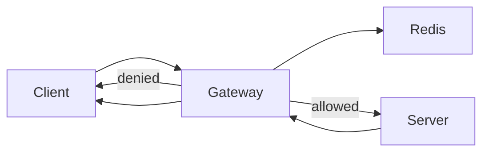
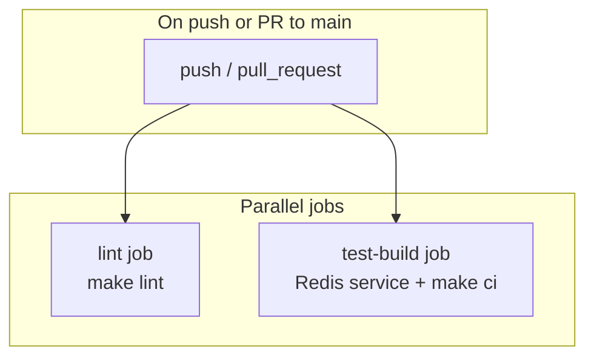

# Distributed Rate Limiter

A Go-based distributed rate limiter that protects a backend API using a **Gateway** pattern, **Redis** for shared state, and atomic **Lua scripts** for accurate enforcement across multiple gateway instances.

## Architecture



| Component | Port | Role |
|-----------|------|------|
| **Gateway** | `:8081` | Rate-limit enforcement + reverse proxy |
| **Server** | `:8080` | Protected backend API (token generation) |
| **Redis** | `:6379` | Distributed counter store |

For a deeper dive, see [docs/architecture.md](docs/architecture.md).

## Quick Start

### Option A: Docker Compose (recommended)

```bash
make docker-up
curl http://localhost:8081/token
```

### Option B: Local development

```bash
# Terminal 1 — Redis
make run-redis

# Terminal 2 — Backend
make run-server

# Terminal 3 — Gateway
make run-gateway

curl http://localhost:8081/token
```

### Rate limit smoke test

With the default limit of 10 requests per 60-second window:

```bash
for i in $(seq 1 11); do
  curl -s -o /dev/null -w "%{http_code}\n" http://localhost:8081/token
done
# Expect: ten 200s, then 429
```

## API

### `GET /token`

Available through the **gateway** at `http://localhost:8081/token` (not directly in production).

**Success (200)**

```json
{
  "token": "019302a4-7b3c-7000-8000-123456789abc",
  "exp": "2026-06-13T20:30:00Z"
}
```

**Rate limited (429)**

```
HTTP/1.1 429 Too Many Requests
Retry-After: 60
```

**Redis unavailable (503)**

```
HTTP/1.1 503 Service Unavailable
```

## Configuration

### Gateway environment variables

| Variable | Default | Description |
|----------|---------|-------------|
| `GATEWAY_ADDR` | `:8081` | Gateway listen address |
| `BACKEND_URL` | `http://localhost:8080` | Upstream server URL |
| `REDIS_ADDR` | `localhost:6379` | Redis address |
| `RATE_LIMIT` | `10` | Max requests per window |
| `WINDOW_SEC` | `60` | Fixed window size (seconds) |
| `KEY_PREFIX` | `rlimit` | Redis key namespace |

The backend server listens on `:8080` with no required environment variables.

## Makefile Reference

Run `make help` to see all targets:

| Target | Description |
|--------|-------------|
| `make build` | Build `bin/server` and `bin/gateway` |
| `make test` | Run all tests with race detector |
| `make test-server` | Run server package tests only |
| `make test-gateway` | Run gateway package tests only |
| `make lint` | Format check + `go vet` |
| `make fmt` | Format all Go files |
| `make ci` | Full pipeline: lint + test + build |
| `make run-redis` | Start Redis via Docker Compose |
| `make run-server` | Run backend on `:8080` |
| `make run-gateway` | Run gateway on `:8081` |
| `make docker-up` | Build and start all services |
| `make docker-down` | Stop all services |

## Testing

```bash
make test           # all packages
make test-server    # internal/server/...
make test-gateway   # internal/gateway/... (uses miniredis, no Docker needed)
make ci             # same as GitHub Actions
```

Test coverage includes:

- Token generation and JSON handler responses
- Client identity extraction and Redis key bucketing
- Config defaults and env overrides
- Fixed-window rate limiter (miniredis-backed Lua script)
- Proxy handler: allow, deny (429), Redis error (503)

## CI

GitHub Actions workflow: [`.github/workflows/ci.yml`](.github/workflows/ci.yml)



Both jobs delegate to the **Makefile** — local `make ci` mirrors CI exactly.

## Project Structure

```
.
├── cmd/
│   ├── gateway/          # Gateway entry point (:8081)
│   └── server/           # Backend entry point (:8080)
├── internal/
│   ├── gateway/
│   │   ├── config/       # Environment-based configuration
│   │   ├── handler/      # Rate-limit check + reverse proxy
│   │   ├── identity/     # Client ID extraction
│   │   └── ratelimit/    # Limiter interface + fixed window
│   └── server/
│       ├── handler/      # HTTP handlers
│       └── service/      # Business logic
├── docs/
│   ├── architecture.md   # System design
│   ├── gateway.md        # Gateway deep dive
│   └── server.md         # Backend deep dive
├── .github/workflows/
│   └── ci.yml            # GitHub Actions
├── docker-compose.yml
├── Dockerfile.gateway
├── Dockerfile.server
└── Makefile
```

## Documentation

- [Architecture](docs/architecture.md) — system design, concurrency, Redis atomicity, resilience
- [Gateway](docs/gateway.md) — rate limiting, proxy flow, configuration
- [Server](docs/server.md) — token API, handler/service layers

## Tech Stack

- **Go 1.25** — `net/http`, `httputil.ReverseProxy`
- **Redis 7** — distributed counters via Lua `EVAL`
- **Docker Compose** — local multi-service development

## License

MIT (or your preferred license)
