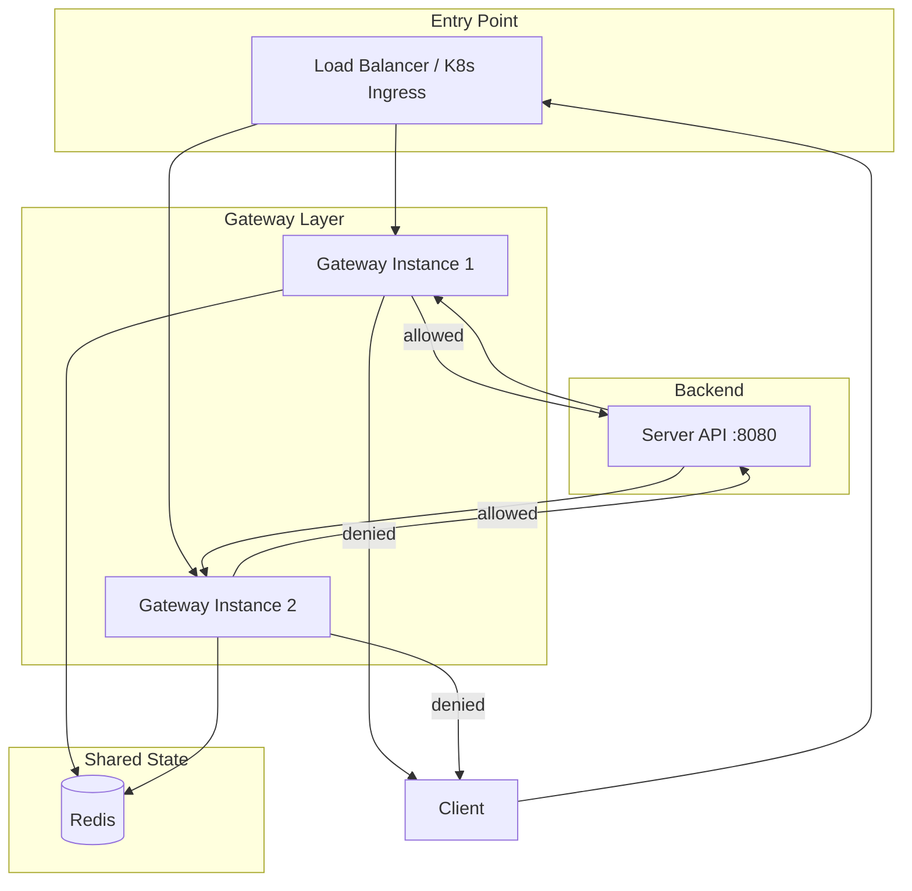
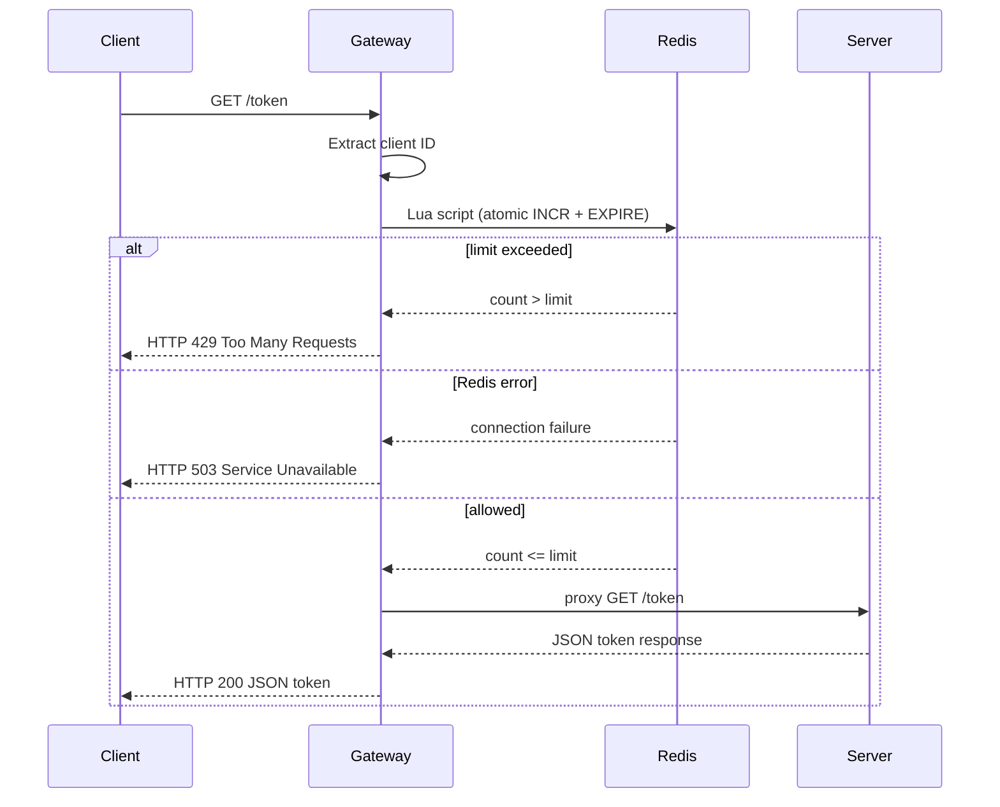
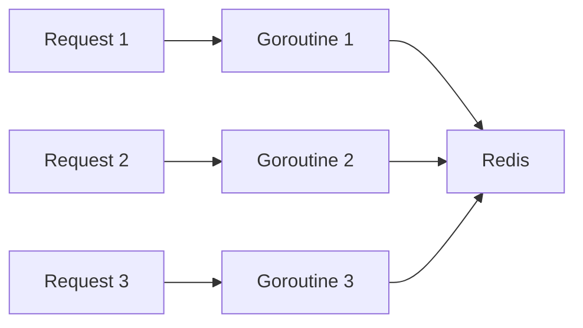

# System Architecture

**Author:** Minh Kha Truong  
**Status:** Implemented  
**Tech Stack:** Go, Redis, Docker Compose, Kubernetes (planned)

---

## 1. Overview

This system protects a backend API from excessive traffic using a **distributed rate limiter**. A Gateway intercepts incoming requests, checks limits against Redis, and either rejects the request (`HTTP 429`) or forwards it to the Backend API. Redis ensures all Gateway instances share a synchronized view of client usage.

## 2. High-Level Architecture



### Components

| Component | Description |
|-----------|-------------|
| **Load Balancer / Ingress** | Distributes client traffic across Gateway instances (Kubernetes in production) |
| **Gateway** (`:8081`) | Rate-limit enforcement point; intercepts `GET` requests, checks Redis, proxies or rejects |
| **Redis** (`:6379`) | Centralized in-memory store for rate-limit counters |
| **Backend API** (`:8080`) | Protected resource; generates tokens for permitted requests |

## 3. Request Flow



### Step-by-step

1. **Client Request** — Client sends `GET /token` to the Gateway (not directly to the backend in production).
2. **Load Balancing** — Ingress routes the request to one of N Gateway instances.
3. **Identity Extraction** — Gateway derives a client key from `X-Forwarded-For` (first IP) or `RemoteAddr`.
4. **State Check** — Gateway runs an atomic Lua script in Redis to increment and check the counter for the current time window.
5. **Decision:**
   - **Allow** — Counter is within limit; request is proxied to the Backend API.
   - **Deny** — Counter exceeds limit; Gateway returns `HTTP 429` with `Retry-After`.
   - **Redis failure** — Gateway returns `HTTP 503` (fail-closed policy).
6. **Backend Processing** — Server generates a UUID token, returns JSON; Gateway passes the response through to the client.

## 4. Concurrency Model

The Gateway uses Go's native `net/http` server, which spawns a goroutine per incoming request. Because the Gateway's work is I/O-bound (Redis and backend HTTP calls), this model provides high throughput without a custom worker pool.



If downstream connection limits become necessary, bounded channels acting as semaphores can throttle concurrent outbound connections.

## 5. Redis Integration and Atomicity

### The concurrency problem

A naive `GET` followed by `INCR` is susceptible to race conditions. Multiple concurrent requests can read the same counter before any increment, allowing bursts to bypass the limit.

### The Lua script solution

Rate-limit logic is embedded in a Lua script executed atomically by Redis:

```lua
local count = redis.call('INCR', KEYS[1])
if count == 1 then
    redis.call('EXPIRE', KEYS[1], ARGV[2])
end
return count
```

This guarantees accurate limits regardless of how many Gateway instances or goroutines are running concurrently.

### Key format

```
{KEY_PREFIX}:{clientID}:{windowStart}
```

Where `windowStart = floor(unix_timestamp / WINDOW_SEC)`.

## 6. Resilience and Failure Handling

### Context propagation

Go's `context.Context` is passed through all layers. If a client disconnects, cancellation propagates to Redis and backend calls, conserving resources.

### Fail-closed policy (current default)

When Redis is unavailable, the Gateway blocks all requests and returns `HTTP 503 Service Unavailable`. This protects the backend from uncontrolled traffic during state store outages.

| Strategy | Behavior | Use case |
|----------|----------|----------|
| **Fail-closed** (current) | Block all requests → 503 | Strict APIs, backend protection |
| **Fail-open** (future) | Bypass rate limiter, forward traffic | High-availability systems |

### Circuit breaker (future)

A localized circuit breaker with configurable strategy will be added to avoid hammering Redis during prolonged outages.

## 7. Package Layout

```
internal/
  gateway/
    config/       # Environment-based settings
    identity/     # Client ID extraction
    ratelimit/    # Limiter interface + fixed-window implementation
    handler/      # Rate check + reverse proxy
  server/
    handler/      # HTTP handlers
    service/      # Token generation logic
cmd/
  gateway/        # Gateway entry point
  server/         # Backend entry point
```

## 8. Future Enhancements

- **Algorithm pluggability** — Swap Fixed Window, Sliding Window Log, and Token Bucket via the `Limiter` interface
- **Fail-open mode** — Configurable `FAIL_MODE` environment variable
- **Circuit breaker** — State machine for Redis health
- **gRPC support** — Handle gRPC streams alongside HTTP
- **Kubernetes manifests** — Deploy Gateway, Server, and Redis to K8s
- **Observability** — Structured logging, metrics (Prometheus), distributed tracing

## 9. Related Documentation

- [Gateway deep dive](gateway.md)
- [Server deep dive](server.md)
- [README](../README.md) — quick start and Makefile reference
