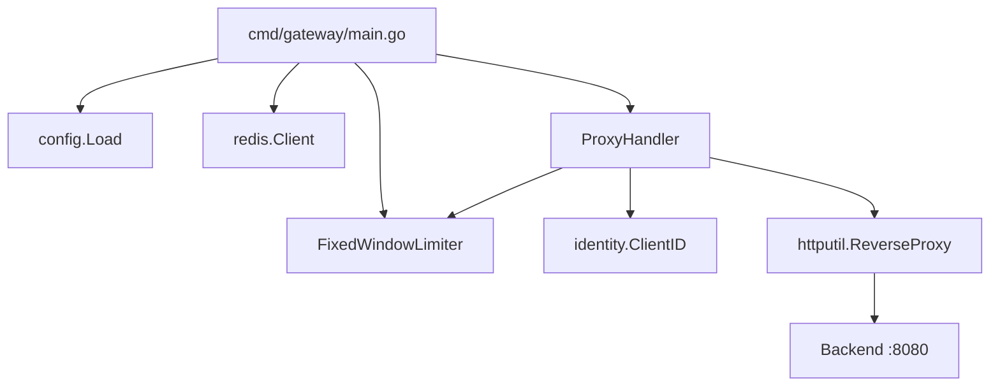
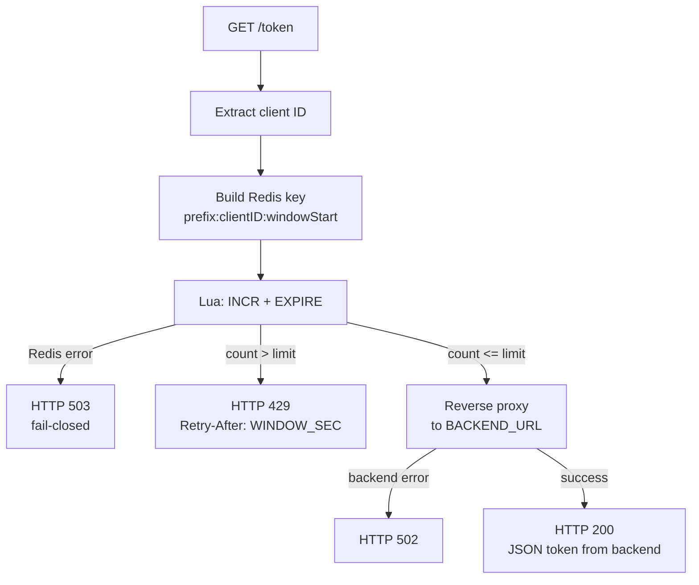
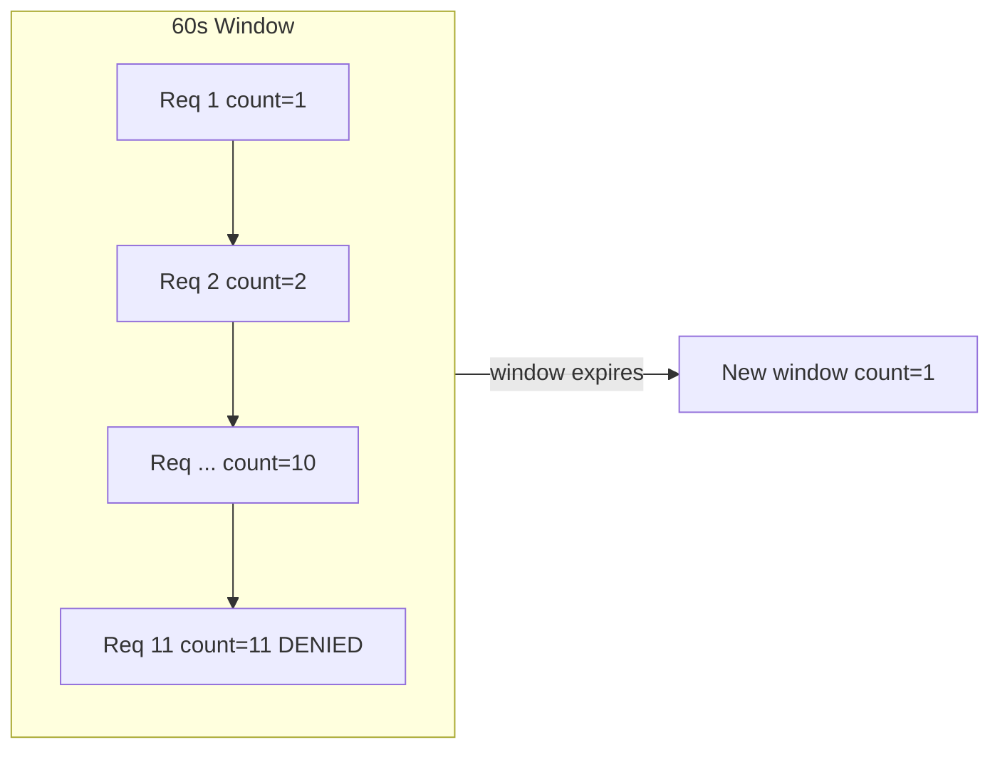
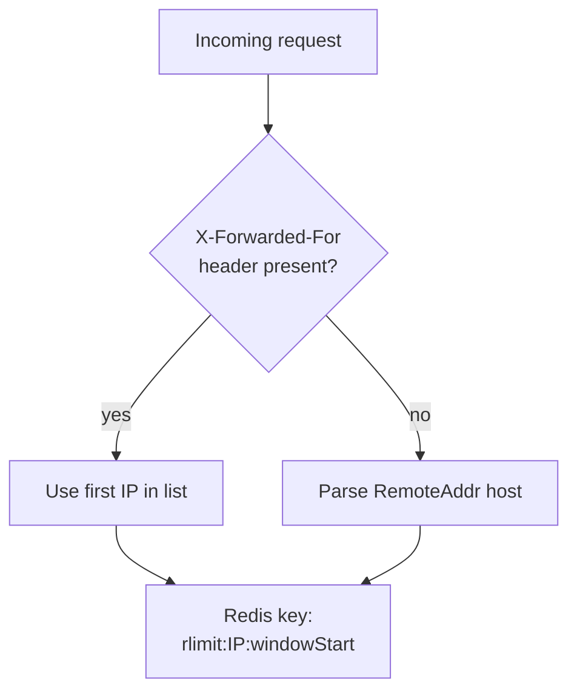
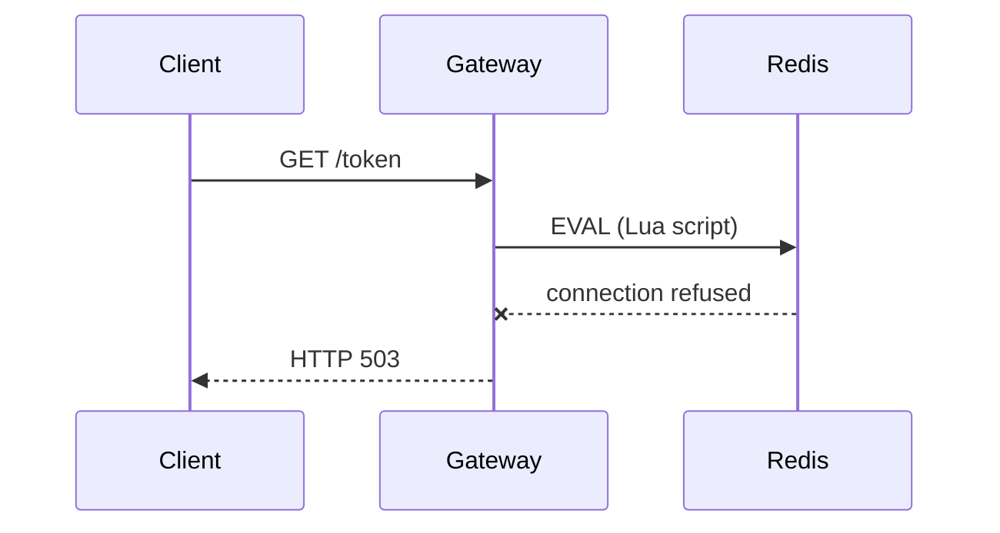

# Gateway

The Gateway is the core rate-limiting enforcement point. It intercepts `GET` requests, checks limits against Redis using an atomic Lua script, and either rejects the request (`HTTP 429`), fails closed on Redis errors (`HTTP 503`), or forwards allowed requests to the backend via a reverse proxy.

## Purpose

- Enforce per-client rate limits across distributed Gateway instances
- Proxy permitted requests to the backend API
- Reject or block traffic before it reaches the backend

## Package Layout

```
cmd/gateway/main.go
  └── internal/gateway/
        ├── config/config.go         # Environment configuration
        ├── identity/identity.go     # Client ID extraction
        ├── ratelimit/
        │     ├── limiter.go         # Limiter interface
        │     └── fixed_window.go    # Redis Lua implementation
        └── handler/proxy.go         # Rate check + reverse proxy
```



## Request Decision Flow



## Rate Limiting: Fixed Window

### Algorithm

The Gateway uses a **fixed window** counter:

1. Each client gets a Redis key per time window: `{prefix}:{clientID}:{windowStart}`
2. Every request atomically increments the counter via Lua
3. On first increment, an `EXPIRE` is set to `WINDOW_SEC`
4. If `count > RATE_LIMIT`, the request is denied



### Lua Script

Executed atomically via `EVAL`:

```lua
local count = redis.call('INCR', KEYS[1])
if count == 1 then
    redis.call('EXPIRE', KEYS[1], ARGV[2])
end
return count
```

| Argument | Value |
|----------|-------|
| `KEYS[1]` | Rate limit key |
| `ARGV[1]` | Rate limit (passed but count check done in Go) |
| `ARGV[2]` | Window TTL in seconds |

Go checks `count <= limit` after the script returns.

### Why Lua?

Standard `GET` + `INCR` has a race condition: multiple goroutines/instances can read the same value before any increment. Lua runs as a single atomic operation inside Redis, guaranteeing accuracy under high concurrency.

## Client Identity



### Examples

| Source | Client ID |
|--------|-----------|
| `X-Forwarded-For: 203.0.113.1, 198.51.100.2` | `203.0.113.1` |
| `RemoteAddr: 192.168.1.10:54321` | `192.168.1.10` |

### Redis key format

```
{KEY_PREFIX}:{clientID}:{windowStart}
```

Example: `rlimit:203.0.113.1:29215040` (with 60s windows)

## Configuration

Loaded from environment variables in `internal/gateway/config/config.go`:

| Variable | Default | Description |
|----------|---------|-------------|
| `GATEWAY_ADDR` | `:8081` | Listen address |
| `BACKEND_URL` | `http://localhost:8080` | Upstream server URL |
| `REDIS_ADDR` | `localhost:6379` | Redis address |
| `RATE_LIMIT` | `10` | Max requests per window |
| `WINDOW_SEC` | `60` | Window size in seconds |
| `KEY_PREFIX` | `rlimit` | Redis key namespace |

### Docker Compose overrides

```yaml
environment:
  BACKEND_URL: http://server:8080
  REDIS_ADDR: redis:6379
  RATE_LIMIT: "10"
  WINDOW_SEC: "60"
```

## HTTP Responses

| Status | Condition | Headers |
|--------|-----------|---------|
| **200** | Allowed, backend succeeds | `Content-Type: application/json` (from backend) |
| **429** | Rate limit exceeded | `Retry-After: {WINDOW_SEC}` |
| **503** | Redis error (fail-closed) | — |
| **502** | Backend unreachable | — |

## Fail-Closed Resilience

When Redis is unavailable, the Gateway returns `HTTP 503` immediately. No requests reach the backend. This is the default policy for strict API protection.



A future `FAIL_MODE=open` environment variable will allow bypassing the rate limiter during Redis outages.

## Limiter Interface

The `ratelimit.Limiter` interface enables future algorithm swapping:

```go
type Result struct {
    Allowed   bool
    Remaining int
}

type Limiter interface {
    Allow(ctx context.Context, key string) (Result, error)
}
```

Current implementation: `FixedWindowLimiter` (Redis + Lua).

Planned: Token Bucket, Sliding Window Log.

## Proxy Handler

`internal/gateway/handler/proxy.go` orchestrates the flow:

1. `identity.ClientID(r)` — extract client key
2. `identity.RateLimitKey(...)` — build Redis key for current window
3. `limiter.Allow(r.Context(), key)` — atomic check
4. On error → 503; on deny → 429; on allow → `httputil.ReverseProxy`

The reverse proxy forwards the original request (method, headers, body) to `BACKEND_URL` and streams the response back to the client.

## Running the Gateway

```bash
# Prerequisites: Redis running, backend running

# Via Makefile
make run-redis    # start Redis
make run-server   # start backend
make run-gateway  # start gateway

# Direct
REDIS_ADDR=localhost:6379 go run ./cmd/gateway

# Full stack via Docker
make docker-up
```

### Manual verification

```bash
# Single allowed request
curl -v http://localhost:8081/token

# Exhaust rate limit (default: 10 per 60s)
for i in $(seq 1 11); do
  curl -s -o /dev/null -w "Request %d: %{http_code}\n" http://localhost:8081/token
done

# Expected output:
# Request 1-10: 200
# Request 11: 429
```

### Fail-closed verification

```bash
# Stop Redis
docker compose stop redis

# Gateway should return 503
curl -s -o /dev/null -w "%{http_code}\n" http://localhost:8081/token
# Expected: 503
```

## Testing

```bash
make test-gateway
```

### Test files

| File | Coverage |
|------|----------|
| `internal/gateway/config/config_test.go` | Default values, env overrides |
| `internal/gateway/identity/identity_test.go` | `X-Forwarded-For`, `RemoteAddr`, window key bucketing |
| `internal/gateway/ratelimit/fixed_window_test.go` | Allow up to limit, deny over limit, key expiry (miniredis) |
| `internal/gateway/handler/proxy_test.go` | Mock limiter: proxy (200), deny (429), Redis error (503) |

Tests use [miniredis](https://github.com/alicebob/miniredis) for Redis simulation — no Docker required locally.

## Graceful Shutdown

`cmd/gateway/main.go` handles `SIGINT` / `SIGTERM`:

1. Stops accepting new connections
2. Waits up to 10 seconds for in-flight requests to complete
3. Closes the Redis client

## Related Documentation

- [Architecture](architecture.md) — full system design
- [Server](server.md) — backend API that receives proxied requests
- [README](../README.md) — quick start and Makefile reference
