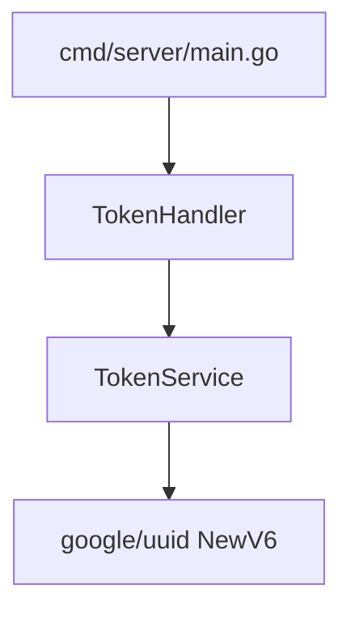
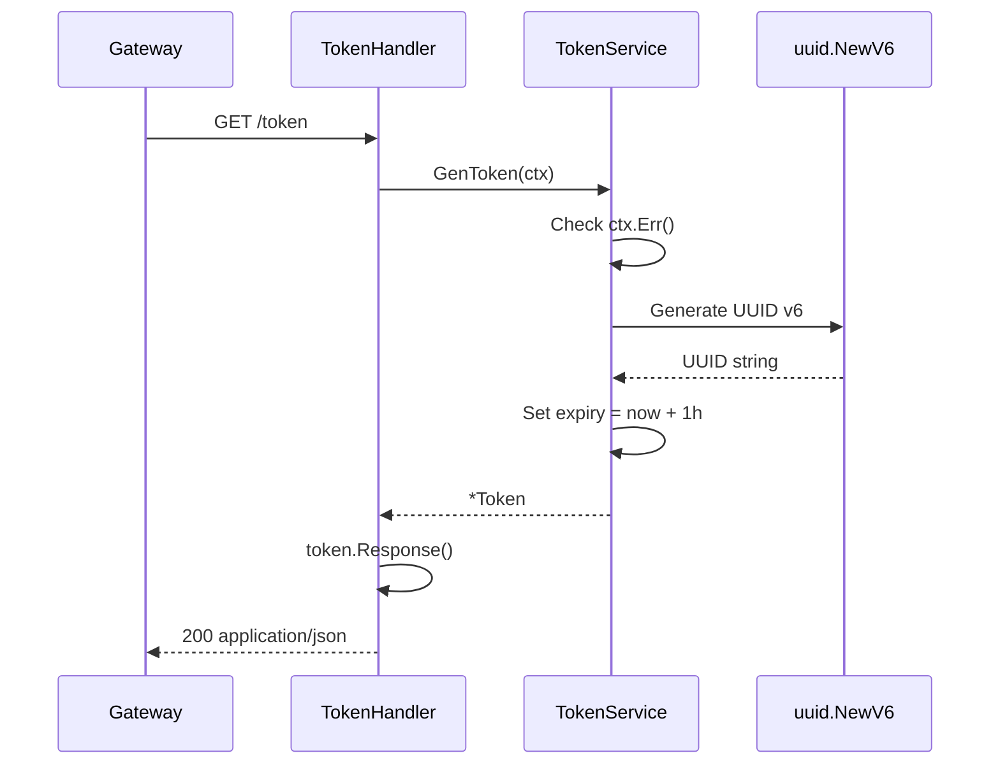

# Server (Backend API)

The backend is a protected resource that generates UUID tokens. In production, clients never reach it directly — all traffic flows through the Gateway, which enforces rate limits before forwarding permitted requests.

## Purpose

- Generate cryptographically random tokens (UUID v6)
- Return structured JSON responses
- Stay free of rate-limiting concerns (separation of concerns)

## Package Layout

```
cmd/server/main.go
  └── internal/server/handler/token.go   (HTTP layer)
        └── internal/server/service/token.go   (business logic)
```



## Request Flow



## API Reference

### `GET /token`

| Property | Value |
|----------|-------|
| Method | `GET` |
| Path | `/token` |
| Port | `:8080` (direct) / `:8081` (via gateway) |
| Content-Type | `application/json` |

**Response (200 OK)**

```json
{
  "token": "019302a4-7b3c-7000-8000-123456789abc",
  "exp": "2026-06-13T20:30:00.123456789Z"
}
```

| Field | Type | Description |
|-------|------|-------------|
| `token` | `string` | UUID v6 token string |
| `exp` | `string` (RFC 3339) | Expiration timestamp (1 hour from generation) |

**Error (500 Internal Server Error)**

Returned when token generation fails (e.g., context cancelled, UUID generation error). No response body.

### Example

```bash
# Direct (development only)
curl http://localhost:8080/token

# Through gateway (production path)
curl http://localhost:8081/token
```

## Code Walkthrough

### TokenService (`internal/server/service/token.go`)

```go
type Token struct {
    token string    // unexported — use Response() accessor
    exp   time.Time
}

type TokenResponse struct {
    Token string    `json:"token"`
    Exp   time.Time `json:"exp"`
}

func (tsv *TokenService) GenToken(ctx context.Context) (*Token, error)
func (t *Token) Response() TokenResponse
```

- `GenToken` checks `ctx.Err()` before generating (supports cancellation propagation)
- Uses `uuid.NewV6()` for time-ordered, random tokens
- Sets expiry to `time.Now().Add(time.Hour)`
- `Response()` exposes fields for JSON encoding without breaking encapsulation

### TokenHandler (`internal/server/handler/token.go`)

```go
func (th *TokenHandler) GetToken(w http.ResponseWriter, r *http.Request)
```

1. Calls `th.svc.GenToken(r.Context())`
2. On error → `500`
3. On success → sets `Content-Type: application/json`, encodes `token.Response()`

### Entry Point (`cmd/server/main.go`)

```go
mux := http.NewServeMux()
mux.HandleFunc("GET /token", tokenHandler.GetToken)
http.ListenAndServe(":8080", mux)
```

Uses Go 1.22+ method-aware routing (`"GET /token"` pattern).

## Context Propagation

The handler passes `r.Context()` to `GenToken`. If the client disconnects or the Gateway cancels the upstream request, token generation aborts early:

```go
if err := ctx.Err(); err != nil {
    return nil, err
}
```

This conserves CPU when requests are already abandoned.

## Running the Server

```bash
# Via Makefile
make run-server

# Direct
go run ./cmd/server

# Docker Compose (with gateway + redis)
make docker-up
```

The server listens on `:8080` with no required environment variables.

## Testing

```bash
make test-server
```

### Test files

| File | Coverage |
|------|----------|
| `internal/server/service/token_test.go` | Valid UUID, expiry range, cancelled context, `Response()` mapping |
| `internal/server/handler/token_test.go` | HTTP 200, `Content-Type`, JSON body with `token` and `exp` keys |

## Design Decisions

| Decision | Rationale |
|----------|-----------|
| Unexported `Token` fields | Encapsulation; handler uses `Response()` accessor |
| UUID v6 | Time-ordered, suitable for distributed systems |
| No rate limiting in server | Single responsibility; gateway handles enforcement |
| No token persistence | Tokens are generated on demand; validation is out of scope for v1 |
| JSON over plain text | Structured, machine-parseable responses |

## Related Documentation

- [Architecture](architecture.md) — full system design
- [Gateway](gateway.md) — how requests reach this server
- [README](../README.md) — quick start
